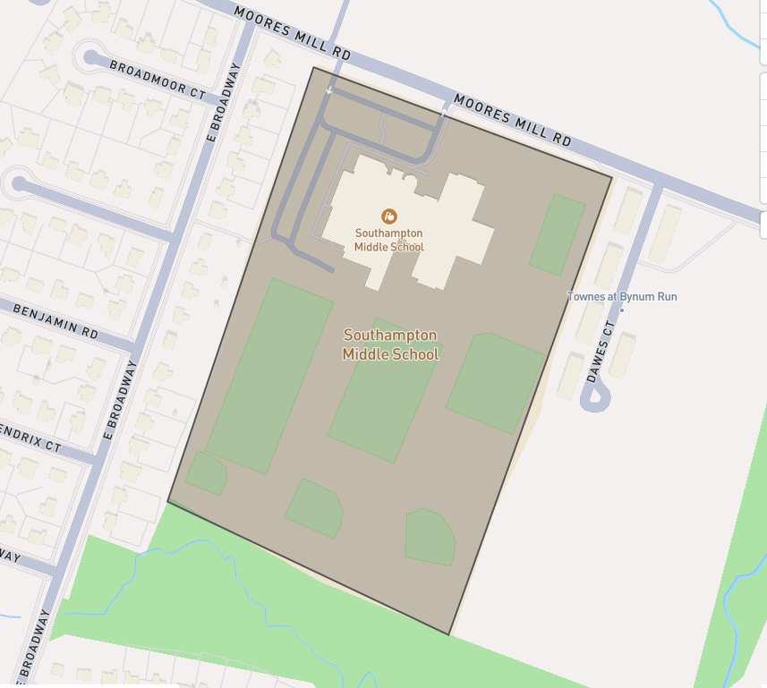
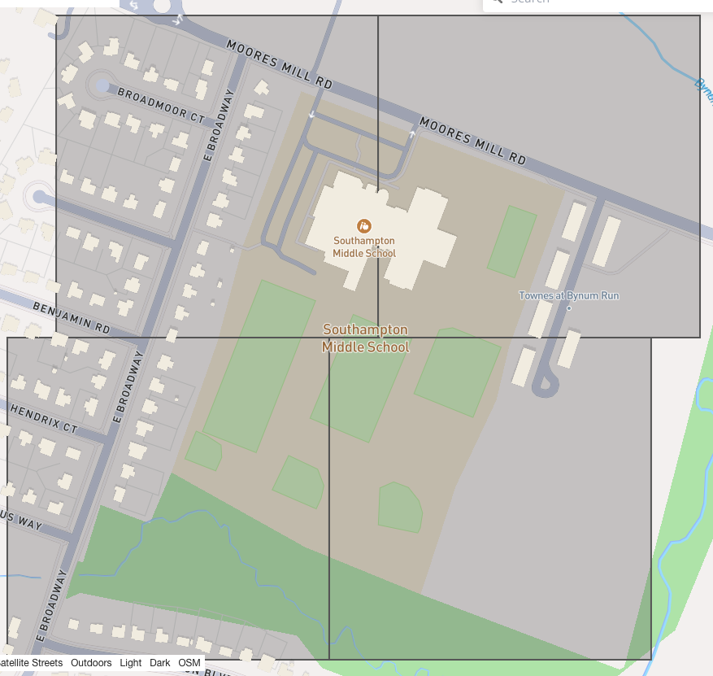

# mtgrid

[](https://github.com/earth-genome/mtgrid/actions/workflows/smoke.yaml)

This is an implementation of the ESA [Major TOM](https://github.com/ESA-PhiLab/Major-TOM) equal area grid in Go.  
This code is based on work in the ESA-PhiLab repository, specifically [here](https://github.com/ESA-PhiLab/Major-TOM/blob/main/src/grid.py)


## Usage: 

Also see [tests](majortom/mtgrid_test.go) 

```go
package main

import (
    "github.com/earth-genome/mtgrid"
)

func main(){

	//create a simple polygon, this is 1/10th of a degree square
	p := orb.Polygon{{{0.0, 0.0},{0.0, 0.1},{0.1, 0.1},{0.1, 0.0},{0.0, 0.0}}}
	//instantiate a new grid with overlaps
    grid := NewGrid(320, true)
	//generate cells that cover the area
    cells, _ := grid.GenerateGridCells(&p)
		//do something with cells 
	for _, cell := range cells {
		fmt.Printf("cell id %s", cell.Id())
    }
}


```

Before:


After:

